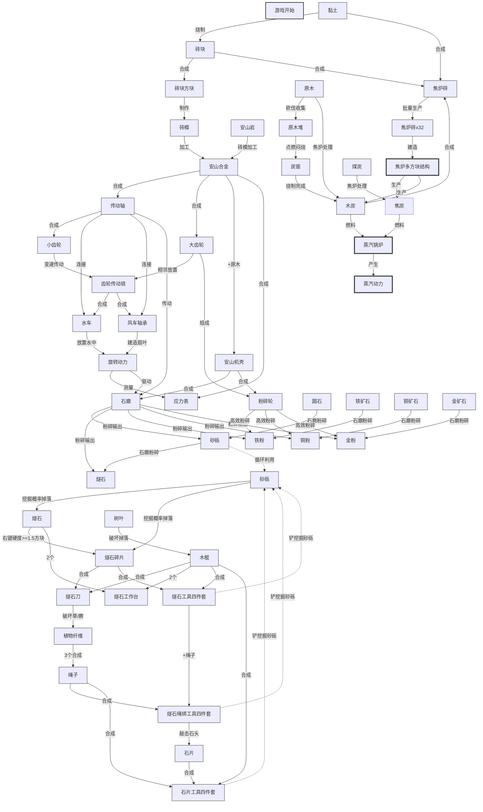

# 第 00 章 机械纪元

## 章节概览

- 时间定位：`0-40 小时`
- 阶段图标：`create:water_wheel`
- 阶段定位：从燧石、木棍、植物纤维开始，建立第一套真正稳定运转的机械工业基础。
- 总任务量：`75`

## 流程图

---

## 模块 01：燧石与木棍

**子阶段**：开局资源
**任务数**：8

| 任务 | 目标 | 检测物品 | 前置 |
|------|------|----------|------|
| 00-001 | 获取任务书 | ftbquests:book | - |
| 00-002 | 挖砂砾 | minecraft:gravel | 00-001 |
| 00-003 | 获得燧石碎片 | gtu_core:flint_shard | 00-002 |
| 00-004 | 燧石右键硬方块获得更多碎片 | gtu_core:flint_shard (x4) | 00-003 |
| 00-005 | 破坏树叶获得木棍 | minecraft:stick | 00-001 |
| 00-006 | 制作燧石刀 | gtu_core:flint_knife | 00-004, 00-005 |
| 00-007 | 制作燧石工作台 | gtu_core:flint_crafting_table | 00-004, 00-005 |
| 00-008 | 使用燧石工作台 | (交互检测) | 00-007 |

### 00-001 获取任务书

- `任务编号`：00-001
- `所属阶段`：第 00 章 机械纪元
- `所属模块`：燧石与木棍
- `任务目标`：获得任务书，开始机械纪元之旅
- `前置任务`：无
- `检测方式`：item
- `检测对象`：ftbquests:book
- `玩家行动说明`：打开任务界面，领取任务书
- `推荐奖励`：基础提示文本

### 00-002 挖砂砾

- `任务编号`：00-002
- `所属阶段`：第 00 章 机械纪元
- `所属模块`：燧石与木棍
- `任务目标`：寻找并挖掘砂砾
- `前置任务`：00-001
- `检测方式`：item
- `检测对象`：minecraft:gravel
- `玩家行动说明`：在河边、洞穴或平原寻找砂砾并挖掘
- `推荐奖励`：少量燧石碎片

### 00-003 获得燧石碎片

- `任务编号`：00-003
- `所属阶段`：第 00 章 机械纪元
- `所属模块`：燧石与木棍
- `任务目标`：从砂砾中获得燧石碎片
- `前置任务`：00-002
- `检测方式`：item
- `检测对象`：gtu_core:flint_shard
- `玩家行动说明`：砂砾有几率掉落燧石碎片而非原版燧石
- `现实依据`：燧石是石器时代最基础的工具材料
- `推荐奖励`：木棍 x4

### 00-004 燧石右键硬方块获得更多碎片

- `任务编号`：00-004
- `所属阶段`：第 00 章 机械纪元
- `所属模块`：燧石与木棍
- `任务目标`：用燧石右键硬度≥1.5的方块，获得燧石碎片
- `前置任务`：00-003
- `检测方式`：item
- `检测对象`：gtu_core:flint_shard (数量≥4)
- `玩家行动说明`：手持燧石右键石头、圆石等硬方块，可以敲下更多燧石碎片
- `现实依据`：燧石敲击硬石会产生锋利的碎片，这是制作工具的基础
- `推荐奖励`：植物纤维 x8

### 00-005 破坏树叶获得木棍

- `任务编号`：00-005
- `所属阶段`：第 00 章 机械纪元
- `所属模块`：燧石与木棍
- `任务目标`：破坏树叶获得木棍
- `前置任务`：00-001
- `检测方式`：item
- `检测对象`：minecraft:stick
- `玩家行动说明`：徒手破坏树叶有几率掉落木棍
- `现实依据`：枯枝是早期工具的手柄材料
- `推荐奖励`：燧石碎片 x2

### 00-006 制作燧石刀

- `任务编号`：00-006
- `所属阶段`：第 00 章 机械纪元
- `所属模块`：燧石与木棍
- `任务目标`：用燧石碎片和木棍制作燧石刀
- `前置任务`：00-004, 00-005
- `检测方式`：item
- `检测对象`：gtu_core:flint_knife
- `配方`：1x 燧石碎片 + 1x 木棍
- `玩家行动说明`：在物品栏中合成燧石刀，用于获取植物纤维
- `现实依据`：燧石刀是采集植物纤维的关键工具
- `推荐奖励`：解锁下一阶段任务

### 00-007 制作燧石工作台

- `任务编号`：00-007
- `所属阶段`：第 00 章 机械纪元
- `所属模块`：燧石与木棍
- `任务目标`：用燧石碎片和木棍制作燧石工作台
- `前置任务`：00-004, 00-005
- `检测方式`：item
- `检测对象`：gtu_core:flint_crafting_table
- `配方`：2x 燧石碎片 + 2x 木棍
- `玩家行动说明`：在物品栏中合成燧石工作台，这是第一个工作台
- `现实依据`：工作台是工业化的起点，从简易工作台开始
- `推荐奖励`：解锁下一阶段任务

### 00-008 使用燧石工作台

- `任务编号`：00-008
- `所属阶段`：第 00 章 机械纪元
- `所属模块`：燧石与木棍
- `任务目标`：放置并使用燧石工作台
- `前置任务`：00-007
- `检测方式`：interaction
- `检测对象`：gtu_core:flint_crafting_table
- `玩家行动说明`：放置燧石工作台并打开界面
- `推荐奖励`：燧石碎片 x8

---

## 模块 02：植物纤维与绳子

**子阶段**：通用材料
**任务数**：5

| 任务 | 目标 | 检测物品 | 前置 |
|------|------|----------|------|
| 00-009 | 用燧石刀破坏高草获得植物纤维 | gtu_core:plant_fiber | 00-006 |
| 00-010 | 收集更多植物纤维 | gtu_core:plant_fiber (x16) | 00-009 |
| 00-011 | 制作绳子 | gtu_core:rope | 00-010 |
| 00-012 | 制作绳绑燧石刀 | gtu_core:bound_flint_knife | 00-006, 00-011 |
| 00-013 | 对比工具耐久 | (使用检测) | 00-012 |

### 00-009 用燧石刀破坏高草获得植物纤维

- `任务编号`：00-009
- `所属阶段`：第 00 章 机械纪元
- `所属模块`：植物纤维与绳子
- `任务目标`：用燧石刀破坏高草或蕨类获得植物纤维
- `前置任务`：00-006
- `检测方式`：item
- `检测对象`：gtu_core:plant_fiber
- `玩家行动说明`：手持燧石刀破坏高草或蕨类，获得植物纤维
- `现实依据`：植物纤维是制作绳子、布料的基础材料
- `推荐奖励`：木棍 x4

### 00-010 收集更多植物纤维

- `任务编号`：00-010
- `所属阶段`：第 00 章 机械纪元
- `所属模块`：植物纤维与绳子
- `任务目标`：收集大量植物纤维
- `前置任务`：00-009
- `检测方式`：item
- `检测对象`：gtu_core:plant_fiber (数量≥16)
- `玩家行动说明`：继续用燧石刀收集植物纤维
- `推荐奖励`：木棍 x8

### 00-011 制作绳子

- `任务编号`：00-011
- `所属阶段`：第 00 章 机械纪元
- `所属模块`：植物纤维与绳子
- `任务目标`：用植物纤维制作绳子
- `前置任务`：00-010
- `检测方式`：item
- `检测对象`：gtu_core:rope
- `配方`：3x 植物纤维 → 1x 绳子
- `玩家行动说明`：在燧石工作台制作绳子
- `现实依据`：绳子是绑定工具的关键材料
- `推荐奖励`：植物纤维 x8

### 00-012 制作绳绑燧石刀

- `任务编号`：00-012
- `所属阶段`：第 00 章 机械纪元
- `所属模块`：植物纤维与绳子
- `任务目标`：用绳子和燧石刀制作绳绑燧石刀
- `前置任务`：00-006, 00-011
- `检测方式`：item
- `检测对象`：gtu_core:bound_flint_knife
- `配方`：1x 燧石刀 + 1x 绳子
- `玩家行动说明`：用绳子绑定燧石刀，增加耐久
- `现实依据`：绑定的工具更牢固
- `推荐奖励`：绳子 x2

### 00-013 对比工具耐久

- `任务编号`：00-013
- `所属阶段`：第 00 章 机械纪元
- `所属模块`：植物纤维与绳子
- `任务目标`：体验绳绑工具的耐久优势
- `前置任务`：00-012
- `检测方式`：stat
- `检测对象`：使用绳绑燧石刀破坏方块
- `玩家行动说明`：对比绳绑工具与普通工具的耐久差异
- `推荐奖励`：解锁下一阶段任务

---

## 模块 03：燧石工具

**子阶段**：第一批工具
**任务数**：6

| 任务 | 目标 | 检测物品 | 前置 |
|------|------|----------|------|
| 00-014 | 制作燧石斧 | gtceu:flint_axe | 00-008 |
| 00-015 | 使用燧石斧砍树 | minecraft:log (x8) | 00-014 |
| 00-016 | 制作燧石镐 | gtceu:flint_pickaxe | 00-008 |
| 00-017 | 使用燧石镐挖石头 | minecraft:cobblestone (x16) | 00-016 |
| 00-018 | 制作燧石锹 | gtceu:flint_shovel | 00-008 |
| 00-019 | 使用燧石锹挖砂砾 | minecraft:gravel (x16) | 00-018 |

### 00-014 制作燧石斧

- `任务编号`：00-014
- `所属阶段`：第 00 章 机械纪元
- `所属模块`：燧石工具
- `任务目标`：在燧石工作台制作燧石斧
- `前置任务`：00-008
- `检测方式`：item
- `检测对象`：gtceu:flint_axe
- `配方`：燧石碎片 + 木棍
- `玩家行动说明`：制作第一个伐木工具
- `推荐奖励`：木棍 x8

### 00-015 使用燧石斧砍树

- `任务编号`：00-015
- `所属阶段`：第 00 章 机械纪元
- `所属模块`：燧石工具
- `任务目标`：用燧石斧砍伐树木
- `前置任务`：00-014
- `检测方式`：item
- `检测对象`：minecraft:log (数量≥8)
- `玩家行动说明`：使用燧石斧砍伐树木，收集原木
- `推荐奖励`：植物纤维 x8

### 00-016 制作燧石镐

- `任务编号`：00-016
- `所属阶段`：第 00 章 机械纪元
- `所属模块`：燧石工具
- `任务目标`：在燧石工作台制作燧石镐
- `前置任务`：00-008
- `检测方式`：item
- `检测对象`：gtceu:flint_pickaxe
- `配方`：燧石碎片 + 木棍
- `玩家行动说明`：制作第一个挖矿工具
- `推荐奖励`：木棍 x8

### 00-017 使用燧石镐挖石头

- `任务编号`：00-017
- `所属阶段`：第 00 章 机械纪元
- `所属模块`：燧石工具
- `任务目标`：用燧石镐挖掘石头
- `前置任务`：00-016
- `检测方式`：item
- `检测对象`：minecraft:cobblestone (数量≥16)
- `玩家行动说明`：使用燧石镐挖掘石头，收集圆石
- `现实依据`：石料是建筑和工具的基础材料
- `推荐奖励`：燧石碎片 x8

### 00-018 制作燧石锹

- `任务编号`：00-018
- `所属阶段`：第 00 章 机械纪元
- `所属模块`：燧石工具
- `任务目标`：在燧石工作台制作燧石锹
- `前置任务`：00-008
- `检测方式`：item
- `检测对象`：gtceu:flint_shovel
- `配方`：燧石碎片 + 木棍
- `玩家行动说明`：制作第一个挖掘工具
- `推荐奖励`：木棍 x8

### 00-019 使用燧石锹挖砂砾

- `任务编号`：00-019
- `所属阶段`：第 00 章 机械纪元
- `所属模块`：燧石工具
- `任务目标`：用燧石锹挖掘砂砾
- `前置任务`：00-018
- `检测方式`：item
- `检测对象`：minecraft:gravel (数量≥16)
- `玩家行动说明`：使用燧石锹挖掘砂砾，效率更高，形成资源循环
- `推荐奖励`：燧石碎片 x4

---

## 模块 04：绳绑燧石工具

**子阶段**：工具升级
**任务数**：4

| 任务 | 目标 | 检测物品 | 前置 |
|------|------|----------|------|
| 00-020 | 制作绳绑燧石斧 | gtu_core:bound_flint_axe | 00-014, 00-011 |
| 00-021 | 制作绳绑燧石镐 | gtu_core:bound_flint_pickaxe | 00-016, 00-011 |
| 00-022 | 制作绳绑燧石锹 | gtu_core:bound_flint_shovel | 00-018, 00-011 |
| 00-023 | 对比工具耐久 | (使用检测) | 00-020 |

### 00-020 制作绳绑燧石斧

- `任务编号`：00-020
- `所属阶段`：第 00 章 机械纪元
- `所属模块`：绳绑燧石工具
- `任务目标`：用绳子和燧石斧制作绳绑燧石斧
- `前置任务`：00-014, 00-011
- `检测方式`：item
- `检测对象`：gtu_core:bound_flint_axe
- `配方`：1x 燧石斧 + 1x 绳子
- `玩家行动说明`：用绳子绑定燧石斧，增加耐久
- `现实依据`：绑定的工具更牢固
- `推荐奖励`：绳子 x2

### 00-021 制作绳绑燧石镐

- `任务编号`：00-021
- `所属阶段`：第 00 章 机械纪元
- `所属模块`：绳绑燧石工具
- `任务目标`：用绳子和燧石镐制作绳绑燧石镐
- `前置任务`：00-016, 00-011
- `检测方式`：item
- `检测对象`：gtu_core:bound_flint_pickaxe
- `配方`：1x 燧石镐 + 1x 绳子
- `玩家行动说明`：用绳子绑定燧石镐，增加耐久
- `推荐奖励`：绳子 x2

### 00-022 制作绳绑燧石锹

- `任务编号`：00-022
- `所属阶段`：第 00 章 机械纪元
- `所属模块`：绳绑燧石工具
- `任务目标`：用绳子和燧石锹制作绳绑燧石锹
- `前置任务`：00-018, 00-011
- `检测方式`：item
- `检测对象`：gtu_core:bound_flint_shovel
- `配方`：1x 燧石锹 + 1x 绳子
- `玩家行动说明`：用绳子绑定燧石锹，增加耐久
- `推荐奖励`：绳子 x2

### 00-023 对比工具耐久

- `任务编号`：00-023
- `所属阶段`：第 00 章 机械纪元
- `所属模块`：绳绑燧石工具
- `任务目标`：体验绳绑工具的耐久优势
- `前置任务`：00-020
- `检测方式`：stat
- `检测对象`：使用绳绑燧石斧破坏方块
- `玩家行动说明`：对比绳绑工具与普通工具的耐久差异
- `推荐奖励`：解锁下一阶段任务

---

## 模块 05：石片工具

**子阶段**：升级工具
**任务数**：7

| 任务 | 目标 | 检测物品 | 前置 |
|------|------|----------|------|
| 00-024 | 用绳绑燧石工具敲石头获得石片 | gtu_core:stone_shard | 00-021 |
| 00-025 | 收集石片 | gtu_core:stone_shard (x16) | 00-024 |
| 00-026 | 制作石片斧 | gtu_core:stone_axe | 00-025, 00-008 |
| 00-027 | 制作石片镐 | gtu_core:stone_pickaxe | 00-025, 00-008 |
| 00-028 | 制作石片锹 | gtu_core:stone_shovel | 00-025, 00-008 |
| 00-029 | 制作石片剑 | gtu_core:stone_sword | 00-025, 00-008 |
| 00-030 | 石片工具效率对比 | (使用检测) | 00-027 |

### 00-024 用绳绑燧石工具敲石头获得石片

- `任务编号`：00-024
- `所属阶段`：第 00 章 机械纪元
- `所属模块`：石片工具
- `任务目标`：用绳绑燧石镐右键石头获得石片
- `前置任务`：00-021
- `检测方式`：item
- `检测对象`：gtu_core:stone_shard
- `玩家行动说明`：手持绳绑燧石镐右键石头，可以敲下石片
- `现实依据`：石片比燧石更锋利，可以制作更好的工具
- `推荐奖励`：木棍 x8

### 00-025 收集石片

- `任务编号`：00-025
- `所属阶段`：第 00 章 机械纪元
- `所属模块`：石片工具
- `任务目标`：收集大量石片
- `前置任务`：00-024
- `检测方式`：item
- `检测对象`：gtu_core:stone_shard (数量≥16)
- `玩家行动说明`：继续敲击石头收集石片
- `推荐奖励`：绳子 x4

### 00-026 制作石片斧

- `任务编号`：00-026
- `所属阶段`：第 00 章 机械纪元
- `所属模块`：石片工具
- `任务目标`：在燧石工作台制作石片斧
- `前置任务`：00-025, 00-008
- `检测方式`：item
- `检测对象`：gtu_core:stone_axe
- `配方`：石片 + 木棍
- `玩家行动说明`：制作比燧石斧更高效的石片斧
- `推荐奖励`：木棍 x8

### 00-027 制作石片镐

- `任务编号`：00-027
- `所属阶段`：第 00 章 机械纪元
- `所属模块`：石片工具
- `任务目标`：在燧石工作台制作石片镐
- `前置任务`：00-025, 00-008
- `检测方式`：item
- `检测对象`：gtu_core:stone_pickaxe
- `配方`：石片 + 木棍
- `玩家行动说明`：制作比燧石镐更高效的石片镐
- `推荐奖励`：木棍 x8

### 00-028 制作石片锹

- `任务编号`：00-028
- `所属阶段`：第 00 章 机械纪元
- `所属模块`：石片工具
- `任务目标`：在燧石工作台制作石片锹
- `前置任务`：00-025, 00-008
- `检测方式`：item
- `检测对象`：gtu_core:stone_shovel
- `配方`：石片 + 木棍
- `玩家行动说明`：制作比燧石锹更高效的石片锹
- `推荐奖励`：木棍 x8

### 00-029 制作石片剑

- `任务编号`：00-029
- `所属阶段`：第 00 章 机械纪元
- `所属模块`：石片工具
- `任务目标`：在燧石工作台制作石片剑
- `前置任务`：00-025, 00-008
- `检测方式`：item
- `检测对象`：gtu_core:stone_sword
- `配方`：石片 + 木棍
- `玩家行动说明`：制作第一把武器
- `推荐奖励`：木棍 x8

### 00-030 石片工具效率对比

- `任务编号`：00-030
- `所属阶段`：第 00 章 机械纪元
- `所属模块`：石片工具
- `任务目标`：体验石片工具的效率优势
- `前置任务`：00-027
- `检测方式`：stat
- `检测对象`：使用石片镐挖掘方块
- `玩家行动说明`：对比石片工具与燧石工具的效率差异
- `推荐奖励`：解锁下一阶段任务

---

## 模块 06：黏土与砖

**子阶段**：建筑材料
**任务数**：8

| 任务 | 目标 | 检测物品 | 前置 |
|------|------|----------|------|
| 00-031 | 寻找黏土 | minecraft:clay_ball | 00-001 |
| 00-032 | 挖掘黏土 | minecraft:clay_ball (x16) | 00-031 |
| 00-033 | 制作黏土块 | minecraft:clay | 00-032 |
| 00-034 | 烧制砖块 | minecraft:brick (x16) | 00-033 |
| 00-035 | 制作砖块 | minecraft:bricks | 00-034 |
| 00-036 | 制作砖模 | gtceu:brick_wooden_form | 00-035 |
| 00-037 | 批量生产砖块 | minecraft:bricks (x32) | 00-036 |
| 00-038 | 建造砖结构 | (方块放置检测) | 00-037 |

### 00-031 寻找黏土

- `任务编号`：00-031
- `所属阶段`：第 00 章 机械纪元
- `所属模块`：黏土与砖
- `任务目标`：在水边寻找黏土
- `前置任务`：00-001
- `检测方式`：item
- `检测对象`：minecraft:clay_ball
- `玩家行动说明`：在河流、湖泊或沼泽边寻找灰色的黏土块
- `推荐奖励`：木棍 x4

### 00-032 挖掘黏土

- `任务编号`：00-032
- `所属阶段`：第 00 章 机械纪元
- `所属模块`：黏土与砖
- `任务目标`：收集大量黏土球
- `前置任务`：00-031
- `检测方式`：item
- `检测对象`：minecraft:clay_ball (数量≥16)
- `玩家行动说明`：挖掘黏土块获得黏土球
- `推荐奖励`：石片 x4

### 00-033 制作黏土块

- `任务编号`：00-033
- `所属阶段`：第 00 章 机械纪元
- `所属模块`：黏土与砖
- `任务目标`：将黏土球合成为黏土块
- `前置任务`：00-032
- `检测方式`：item
- `检测对象`：minecraft:clay
- `玩家行动说明`：4个黏土球合成1个黏土块
- `推荐奖励`：绳子 x2

### 00-034 烧制砖块

- `任务编号`：00-034
- `所属阶段`：第 00 章 机械纪元
- `所属模块`：黏土与砖
- `任务目标`：在熔炉中烧制黏土球得到砖块
- `前置任务`：00-033
- `检测方式`：item
- `检测对象`：minecraft:brick (数量≥16)
- `玩家行动说明`：将黏土球放入熔炉烧制成砖
- `现实依据`：烧制砖块是人类最早的工业化生产之一
- `推荐奖励`：木炭 x8

### 00-035 制作砖块

- `任务编号`：00-035
- `所属阶段`：第 00 章 机械纪元
- `所属模块`：黏土与砖
- `任务目标`：用砖块合成砖块方块
- `前置任务`：00-034
- `检测方式`：item
- `检测对象`：minecraft:bricks
- `玩家行动说明`：4个砖块合成1个砖块方块
- `推荐奖励`：砖块 x8

### 00-036 制作砖模

- `任务编号`：00-036
- `所属阶段`：第 00 章 机械纪元
- `所属模块`：黏土与砖
- `任务目标`：制作砖模用于批量生产砖块
- `前置任务`：00-035
- `检测方式`：item
- `检测对象`：gtceu:brick_wooden_form
- `玩家行动说明`：用木板和木棍制作砖模
- `现实依据`：砖模是工业化制砖的关键工具
- `推荐奖励`：木板 x8

### 00-037 批量生产砖块

- `任务编号`：00-037
- `所属阶段`：第 00 章 机械纪元
- `所属模块`：黏土与砖
- `任务目标`：使用砖模批量生产砖块
- `前置任务`：00-036
- `检测方式`：item
- `检测对象`：minecraft:bricks (数量≥32)
- `玩家行动说明`：使用砖模可以提高砖块生产效率
- `推荐奖励`：砖块 x16

### 00-038 建造砖结构

- `任务编号`：00-038
- `所属阶段`：第 00 章 机械纪元
- `所属模块`：黏土与砖
- `任务目标`：建造砖结构建筑
- `前置任务`：00-037
- `检测方式`：block
- `检测对象`：放置minecraft:bricks方块
- `玩家行动说明`：用砖块建造一个简单的建筑
- `推荐奖励`：解锁下一阶段任务

---

## 模块 07：安山合金

**子阶段**：Create入口
**任务数**：6

| 任务 | 目标 | 检测物品 | 前置 |
|------|------|----------|------|
| 00-039 | 寻找安山岩 | minecraft:andesite | 00-017 |
| 00-040 | 挖掘安山岩 | minecraft:andesite (x32) | 00-039 |
| 00-041 | 制作安山合金 | create:andesite_alloy | 00-040, 00-003 |
| 00-042 | 制作安山机壳 | create:andesite_casing | 00-041 |
| 00-043 | 认识应力系统 | (JEI/EMI查看) | 00-042 |
| 00-044 | 制作应力表 | create:gauge | 00-041 |

### 00-039 寻找安山岩

- `任务编号`：00-039
- `所属阶段`：第 00 章 机械纪元
- `所属模块`：安山合金
- `任务目标`：寻找安山岩矿脉
- `前置任务`：00-017
- `检测方式`：item
- `检测对象`：minecraft:andesite
- `玩家行动说明`：在洞穴或山脉中寻找灰色的安山岩
- `推荐奖励`：石片 x8

### 00-040 挖掘安山岩

- `任务编号`：00-040
- `所属阶段`：第 00 章 机械纪元
- `所属模块`：安山合金
- `任务目标`：收集大量安山岩
- `前置任务`：00-039
- `检测方式`：item
- `检测对象`：minecraft:andesite (数量≥32)
- `玩家行动说明`：使用石片镐挖掘安山岩效率更高
- `推荐奖励`：燧石碎片 x8

### 00-041 制作安山合金

- `任务编号`：00-041
- `所属阶段`：第 00 章 机械纪元
- `所属模块`：安山合金
- `任务目标`：用安山岩和燧石碎片制作安山合金
- `前置任务`：00-040, 00-003
- `检测方式`：item
- `检测对象`：create:andesite_alloy
- `配方`：安山岩 + 燧石碎片（使用砖模加工）
- `玩家行动说明`：安山合金是Create机械系统的核心材料
- `现实依据`：合金技术标志着从石器到金属的过渡
- `推荐奖励`：木棍 x16

### 00-042 制作安山机壳

- `任务编号`：00-042
- `所属阶段`：第 00 章 机械纪元
- `所属模块`：安山合金
- `任务目标`：用安山合金制作安山机壳
- `前置任务`：00-041
- `检测方式`：item
- `检测对象`：create:andesite_casing
- `配方`：安山合金 + 原木
- `玩家行动说明`：安山机壳是Create机器的外壳
- `推荐奖励`：安山合金 x4

### 00-043 认识应力系统

- `任务编号`：00-043
- `所属阶段`：第 00 章 机械纪元
- `所属模块`：安山合金
- `任务目标`：在JEI/EMI中查看应力相关信息
- `前置任务`：00-042
- `检测方式`：custom
- `检测对象`：查看create:shaft的JEI信息
- `玩家行动说明`：了解应力的概念，这是Create系统的核心
- `推荐奖励`：提示文本

### 00-044 制作应力表

- `任务编号`：00-044
- `所属阶段`：第 00 章 机械纪元
- `所属模块`：安山合金
- `任务目标`：制作应力表用于测量应力
- `前置任务`：00-041
- `检测方式`：item
- `检测对象`：create:gauge
- `玩家行动说明`：应力表可以显示当前网络的应力值
- `推荐奖励`：解锁下一阶段任务

---

## 模块 08：传动系统

**子阶段**：动力基础
**任务数**：8

| 任务 | 目标 | 检测物品 | 前置 |
|------|------|----------|------|
| 00-045 | 制作传动轴 | create:shaft (x16) | 00-041 |
| 00-046 | 放置传动轴 | (方块放置) | 00-045 |
| 00-047 | 制作大齿轮 | create:cogwheel | 00-045 |
| 00-048 | 制作小齿轮 | create:large_cogwheel | 00-047 |
| 00-049 | 齿轮传动链 | (结构检测) | 00-047, 00-048 |
| 00-050 | 制作水车 | create:water_wheel | 00-049 |
| 00-051 | 水车供电 | (应力检测 >0) | 00-050 |
| 00-052 | 制作风车轴承 | create:windmill_bearing | 00-049 |

### 00-045 制作传动轴

- `任务编号`：00-045
- `所属阶段`：第 00 章 机械纪元
- `所属模块`：传动系统
- `任务目标`：用安山合金制作传动轴
- `前置任务`：00-041
- `检测方式`：item
- `检测对象`：create:shaft (数量≥16)
- `配方`：安山合金 + 木棍
- `玩家行动说明`：传动轴是传递动力的基础
- `推荐奖励`：安山合金 x8

### 00-046 放置传动轴

- `任务编号`：00-046
- `所属阶段`：第 00 章 机械纪元
- `所属模块`：传动系统
- `任务目标`：放置传动轴并观察其旋转
- `前置任务`：00-045
- `检测方式`：block
- `检测对象`：放置create:shaft
- `玩家行动说明`：传动轴需要动力源才能旋转
- `推荐奖励`：传动轴 x8

### 00-047 制作大齿轮

- `任务编号`：00-047
- `所属阶段`：第 00 章 机械纪元
- `所属模块`：传动系统
- `任务目标`：制作大齿轮用于传动
- `前置任务`：00-045
- `检测方式`：item
- `检测对象`：create:cogwheel
- `配方`：安山合金 + 木板
- `玩家行动说明`：大齿轮可以连接传动轴
- `推荐奖励`：安山合金 x4

### 00-048 制作小齿轮

- `任务编号`：00-048
- `所属阶段`：第 00 章 机械纪元
- `所属模块`：传动系统
- `任务目标`：制作小齿轮用于变速传动
- `前置任务`：00-047
- `检测方式`：item
- `检测对象`：create:large_cogwheel
- `配方`：安山合金 + 木板
- `玩家行动说明`：小齿轮可以改变传动速度
- `推荐奖励`：安山合金 x4

### 00-049 齿轮传动链

- `任务编号`：00-049
- `所属阶段`：第 00 章 机械纪元
- `所属模块`：传动系统
- `任务目标`：搭建齿轮传动链
- `前置任务`：00-047, 00-048
- `检测方式`：structure
- `检测对象`：相邻放置的大齿轮和小齿轮
- `玩家行动说明`：将大齿轮和小齿轮相邻放置，形成传动链
- `推荐奖励`：齿轮 x4

### 00-050 制作水车

- `任务编号`：00-050
- `所属阶段`：第 00 章 机械纪元
- `所属模块`：传动系统
- `任务目标`：制作水车作为动力源
- `前置任务`：00-049
- `检测方式`：item
- `检测对象`：create:water_wheel
- `配方`：安山合金 + 木板
- `玩家行动说明`：水车需要放置在流动水中才能工作
- `现实依据`：水车是人类最早利用自然动力的装置
- `推荐奖励`：安山合金 x8

### 00-051 水车供电

- `任务编号`：00-051
- `所属阶段`：第 00 章 机械纪元
- `所属模块`：传动系统
- `任务目标`：让水车产生动力
- `前置任务`：00-050
- `检测方式`：energy
- `检测对象`：应力值 > 0
- `玩家行动说明`：将水车放置在流动水中，连接传动轴
- `推荐奖励`：传动轴 x16

### 00-052 制作风车轴承

- `任务编号`：00-052
- `所属阶段`：第 00 章 机械纪元
- `所属模块`：传动系统
- `任务目标`：制作风车轴承作为另一个动力源
- `前置任务`：00-049
- `检测方式`：item
- `检测对象`：create:windmill_bearing
- `配方`：安山合金 + 木板
- `玩家行动说明`：风车需要建造扇叶才能工作
- `推荐奖励`：解锁下一阶段任务

---

## 模块 09：石磨工艺

**子阶段**：矿物处理
**任务数**：6

| 任务 | 目标 | 检测物品 | 前置 |
|------|------|----------|------|
| 00-053 | 制作石磨 | create:millstone | 00-050 |
| 00-054 | 石磨接入动力 | (应力检测) | 00-053 |
| 00-055 | 粉碎圆石获得砂砾 | minecraft:gravel | 00-054 |
| 00-056 | 粉碎砂砾获得燧石 | minecraft:flint | 00-055 |
| 00-057 | 粉碎矿石获得矿粉 | (矿石粉末) | 00-054 |
| 00-058 | 建立矿物处理线 | (结构检测) | 00-057 |

### 00-053 制作石磨

- `任务编号`：00-053
- `所属阶段`：第 00 章 机械纪元
- `所属模块`：石磨工艺
- `任务目标`：制作石磨用于粉碎矿物
- `前置任务`：00-050
- `检测方式`：item
- `检测对象`：create:millstone
- `配方`：安山机壳 + 石头
- `玩家行动说明`：石磨需要接入动力才能工作
- `现实依据`：石磨是最早的矿物处理设备
- `推荐奖励`：安山机壳 x4

### 00-054 石磨接入动力

- `任务编号`：00-054
- `所属阶段`：第 00 章 机械纪元
- `所属模块`：石磨工艺
- `任务目标`：将石磨接入动力系统
- `前置任务`：00-053
- `检测方式`：energy
- `检测对象`：石磨应力 > 0
- `玩家行动说明`：用传动轴将石磨连接到水车
- `推荐奖励`：圆石 x32

### 00-055 粉碎圆石获得砂砾

- `任务编号`：00-055
- `所属阶段`：第 00 章 机械纪元
- `所属模块`：石磨工艺
- `任务目标`：用石磨粉碎圆石获得砂砾
- `前置任务`：00-054
- `检测方式`：item
- `检测对象`：minecraft:gravel
- `玩家行动说明`：右键石磨放入圆石，等待粉碎
- `推荐奖励`：圆石 x32

### 00-056 粉碎砂砾获得燧石

- `任务编号`：00-056
- `所属阶段`：第 00 章 机械纪元
- `所属模块`：石磨工艺
- `任务目标`：用石磨粉碎砂砾获得燧石
- `前置任务`：00-055
- `检测方式`：item
- `检测对象`：minecraft:flint
- `玩家行动说明`：粉碎砂砾有几率获得燧石
- `推荐奖励`：砂砾 x32

### 00-057 粉碎矿石获得矿粉

- `任务编号`：00-057
- `所属阶段`：第 00 章 机械纪元
- `所属模块`：石磨工艺
- `任务目标`：用石磨粉碎矿石获得矿粉
- `前置任务`：00-054
- `检测方式`：item
- `检测对象`：矿石粉末
- `玩家行动说明`：粉碎矿石可以获得矿粉，是冶炼的前置
- `推荐奖励`：铁矿石 x16

### 00-058 建立矿物处理线

- `任务编号`：00-058
- `所属阶段`：第 00 章 机械纪元
- `所属模块`：石磨工艺
- `任务目标`：建立完整的矿物处理流水线
- `前置任务`：00-057
- `检测方式`：structure
- `检测对象`：水车 + 传动轴 + 石磨
- `玩家行动说明`：将动力系统和石磨整合成一个完整的生产线
- `推荐奖励`：解锁下一阶段任务

---

## 模块 10：物流基础

**子阶段**：工厂雏形
**任务数**：6

| 任务 | 目标 | 检测物品 | 前置 |
|------|------|----------|------|
| 00-059 | 制作Depot | create:depot | 00-041 |
| 00-060 | 制作Basin | create:basin | 00-041 |
| 00-061 | 制作动力活塞 | create:mechanical_piston | 00-047 |
| 00-062 | 制作传送带 | create:belt (x16) | 00-047 |
| 00-063 | 建立基础物流线 | (结构检测) | 00-059, 00-062 |
| 00-064 | 自动化石磨产线 | (结构检测) | 00-058, 00-063 |

### 00-059 制作Depot

- `任务编号`：00-059
- `所属阶段`：第 00 章 机械纪元
- `所属模块`：物流基础
- `任务目标`：制作Depot用于物品暂存
- `前置任务`：00-041
- `检测方式`：item
- `检测对象`：create:depot
- `配方`：安山合金 + 木板
- `玩家行动说明`：Depot可以放置物品，是物流系统的基础
- `推荐奖励`：安山合金 x4

### 00-060 制作Basin

- `任务编号`：00-060
- `所属阶段`：第 00 章 机械纪元
- `所属模块`：物流基础
- `任务目标`：制作Basin用于物品加工
- `前置任务`：00-041
- `检测方式`：item
- `检测对象`：create:basin
- `配方`：安山合金 + 木板
- `玩家行动说明`：Basin可以接收流体和物品进行加工
- `推荐奖励`：安山合金 x4

### 00-061 制作动力活塞

- `任务编号`：00-061
- `所属阶段`：第 00 章 机械纪元
- `所属模块`：物流基础
- `任务目标`：制作动力活塞用于移动物品
- `前置任务`：00-047
- `检测方式`：item
- `检测对象`：create:mechanical_piston
- `配方`：安山合金 + 铁锭
- `玩家行动说明`：动力活塞可以推动物品和方块
- `推荐奖励`：安山合金 x8

### 00-062 制作传送带

- `任务编号`：00-062
- `所属阶段`：第 00 章 机械纪元
- `所属模块`：物流基础
- `任务目标`：制作传送带用于物品运输
- `前置任务`：00-047
- `检测方式`：item
- `检测对象`：create:belt (数量≥16)
- `配方`：安山合金 + 皮革
- `玩家行动说明`：传送带可以自动运输物品
- `推荐奖励`：皮革 x8

### 00-063 建立基础物流线

- `任务编号`：00-063
- `所属阶段`：第 00 章 机械纪元
- `所属模块`：物流基础
- `任务目标`：建立传送带物流线
- `前置任务`：00-059, 00-062
- `检测方式`：structure
- `检测对象`：Depot + 传送带连接
- `玩家行动说明`：用传送带连接Depot，形成物流线
- `推荐奖励`：传送带 x16

### 00-064 自动化石磨产线

- `任务编号`：00-064
- `所属阶段`：第 00 章 机械纪元
- `所属模块`：物流基础
- `任务目标`：建立自动化石磨生产线
- `前置任务`：00-058, 00-063
- `检测方式`：structure
- `检测对象`：完整自动化产线
- `玩家行动说明`：整合动力、石磨、物流形成自动化生产线
- `推荐奖励`：解锁下一阶段任务

---

## 模块 11：炭窑与焦炉

**子阶段**：蒸汽前夜
**任务数**：11

| 任务 | 目标 | 检测物品 | 前置 |
|------|------|----------|------|
| 00-065 | 收集原木 | minecraft:log (x32) | 00-015 |
| 00-066 | 制作木炭 | minecraft:charcoal | 00-065 |
| 00-067 | 建造炭窑 | (结构检测) | 00-066 |
| 00-068 | 批量生产木炭 | minecraft:charcoal (x32) | 00-067 |
| 00-069 | 寻找煤炭 | minecraft:coal | 00-001 |
| 00-070 | 制作焦炉砖 | gtceu:coke_oven_brick | 00-034, 00-068 |
| 00-071 | 焦炉砖批量生产 | gtceu:coke_oven_brick (x32) | 00-070 |
| 00-072 | 建造焦炉 | (多方块结构检测) | 00-071 |
| 00-073 | 生产焦炭 | gtceu:coke | 00-072 |
| 00-074 | 了解蒸汽时代 | (JEI/EMI查看) | 00-073 |
| 00-075 | 准备进入蒸汽时代 | (任务完成) | 00-074 |

### 00-065 收集原木

- `任务编号`：00-065
- `所属阶段`：第 00 章 机械纪元
- `所属模块`：炭窑与焦炉
- `任务目标`：收集大量原木用于烧制木炭
- `前置任务`：00-015
- `检测方式`：item
- `检测对象`：minecraft:log (数量≥32)
- `玩家行动说明`：使用更好的斧头砍伐树木
- `推荐奖励`：石片斧 x1

### 00-066 制作木炭

- `任务编号`：00-066
- `所属阶段`：第 00 章 机械纪元
- `所属模块`：炭窑与焦炉
- `任务目标`：在熔炉中烧制原木获得木炭
- `前置任务`：00-065
- `检测方式`：item
- `检测对象`：minecraft:charcoal
- `玩家行动说明`：将原木放入熔炉烧制成木炭
- `推荐奖励`：原木 x16

### 00-067 建造炭窑

- `任务编号`：00-067
- `所属阶段`：第 00 章 机械纪元
- `所属模块`：炭窑与焦炉
- `任务目标`：建造炭窑用于批量生产木炭
- `前置任务`：00-066
- `检测方式`：structure
- `检测对象`：炭窑结构
- `玩家行动说明`：用砖块建造炭窑结构
- `现实依据`：炭窑是工业化烧炭的基础设施
- `推荐奖励`：砖块 x16

### 00-068 批量生产木炭

- `任务编号`：00-068
- `所属阶段`：第 00 章 机械纪元
- `所属模块`：炭窑与焦炉
- `任务目标`：使用炭窑批量生产木炭
- `前置任务`：00-067
- `检测方式`：item
- `检测对象`：minecraft:charcoal (数量≥32)
- `玩家行动说明`：炭窑可以更高效地生产木炭
- `推荐奖励`：砖块 x32

### 00-069 寻找煤炭

- `任务编号`：00-069
- `所属阶段`：第 00 章 机械纪元
- `所属模块`：炭窑与焦炉
- `任务目标`：寻找煤炭矿脉
- `前置任务`：00-001
- `检测方式`：item
- `检测对象`：minecraft:coal
- `玩家行动说明`：在洞穴中寻找煤炭
- `推荐奖励`：火把 x16

### 00-070 制作焦炉砖

- `任务编号`：00-070
- `所属阶段`：第 00 章 机械纪元
- `所属模块`：炭窑与焦炉
- `任务目标`：用砖块和木炭制作焦炉砖
- `前置任务`：00-034, 00-068
- `检测方式`：item
- `检测对象`：gtceu:coke_oven_brick
- `配方`：砖块 + 木炭 + 黏土
- `玩家行动说明`：焦炉砖是建造焦炉的关键材料
- `现实依据`：焦炉砖需要特殊配方才能承受高温
- `推荐奖励`：砖块 x16

### 00-071 焦炉砖批量生产

- `任务编号`：00-071
- `所属阶段`：第 00 章 机械纪元
- `所属模块`：炭窑与焦炉
- `任务目标`：批量生产焦炉砖
- `前置任务`：00-070
- `检测方式`：item
- `检测对象`：gtceu:coke_oven_brick (数量≥32)
- `玩家行动说明`：收集材料批量生产焦炉砖
- `推荐奖励`：木炭 x32

### 00-072 建造焦炉

- `任务编号`：00-072
- `所属阶段`：第 00 章 机械纪元
- `所属模块`：炭窑与焦炉
- `任务目标`：建造焦炉多方块结构
- `前置任务`：00-071
- `检测方式`：multiblock
- `检测对象`：焦炉多方块结构
- `玩家行动说明`：用焦炉砖建造焦炉多方块结构
- `现实依据`：焦炉是钢铁工业的核心设备
- `推荐奖励`：焦炉砖 x16

### 00-073 生产焦炭

- `任务编号`：00-073
- `所属阶段`：第 00 章 机械纪元
- `所属模块`：炭窑与焦炉
- `任务目标`：用焦炉生产焦炭
- `前置任务`：00-072
- `检测方式`：item
- `检测对象`：gtceu:coke
- `玩家行动说明`：将煤炭放入焦炉生产焦炭
- `现实依据`：焦炭是钢铁冶炼的关键燃料
- `推荐奖励`：焦炭 x32

### 00-074 了解蒸汽时代

- `任务编号`：00-074
- `所属阶段`：第 00 章 机械纪元
- `所属模块`：炭窑与焦炉
- `任务目标`：在JEI/EMI中查看蒸汽相关设备
- `前置任务`：00-073
- `检测方式`：custom
- `检测对象`：查看蒸汽锅炉信息
- `玩家行动说明`：了解蒸汽时代的基础设备
- `推荐奖励`：提示文本

### 00-075 准备进入蒸汽时代

- `任务编号`：00-075
- `所属阶段`：第 00 章 机械纪元
- `所属模块`：炭窑与焦炉
- `任务目标`：完成机械纪元所有任务
- `前置任务`：00-074
- `检测方式`：custom
- `检测对象`：任务完成检测
- `玩家行动说明`：恭喜完成机械纪元，准备进入蒸汽时代
- `推荐奖励`：解锁下一章节任务

---

## 章节完成奖励

完成所有75个任务后，玩家将获得：

1. 稳定的动力系统（水车/风车）
2. 基础矿物处理能力（石磨）
3. 物流系统基础（传送带、Depot）
4. 冶炼能力（焦炉）
5. 进入蒸汽时代的资格

---

## 与下一章的衔接

完成焦炉建设后，玩家将解锁第01章"蒸汽时代"的任务线。

蒸汽时代将引入：
- 蒸汽锅炉
- 蒸汽机
- 铁路系统
- 更高级的矿物处理

---

## 需要新增的物品/配方

### 物品
| 物品                           | 用途           | 状态      |
|------------------------------|--------------|---------|
| gtu_core:plant_fiber         | 植物纤维，高草掉落    | 已注册     |
| gtu_core:flint_shard         | 燧石碎片，砂砾/右键获得 | 已注册     |
| gtceu:flint_knife            | 燧石刀，获取植物纤维   | 已拥有     |
| gtu_core:stone_shard         | 石片，工具加工石头获得  | **需新增** |
| gtu_core:rope                | 绳子，植物纤维合成    | **需新增** |
| gtu_core:bound_flint_knife   | 绳绑燧石刀        | **需新增** |
| gtu_core:bound_flint_axe     | 绳绑燧石斧        | **需新增** |
| gtu_core:bound_flint_pickaxe | 绳绑燧石镐        | **需新增** |
| gtu_core:bound_flint_shovel  | 绳绑燧石锹        | **需新增** |
| gtu_core:stone_axe           | 石片斧          | **需新增** |
| gtu_core:stone_pickaxe       | 石片镐          | **需新增** |
| gtu_core:stone_shovel        | 石片锹          | **需新增** |
| gtu_core:stone_sword         | 石片剑          | **需新增** |

### 配方
| 配方    | 材料              | 结果       |
|-------|-----------------|----------|
| 燧石刀   | 1x 燧石碎片 + 1x 木棍 | 1x 燧石刀   |
| 绳子    | 3x 植物纤维         | 1x 绳子    |
| 绳绑燧石刀 | 1x 燧石刀 + 1x 绳子  | 1x 绳绑燧石刀 |
| 绳绑燧石斧 | 1x 燧石斧 + 1x 绳子  | 1x 绳绑燧石斧 |
| 绳绑燧石镐 | 1x 燧石镐 + 1x 绳子  | 1x 绳绑燧石镐 |
| 绳绑燧石锹 | 1x 燧石锹 + 1x 绳子  | 1x 绳绑燧石锹 |
| 石片工具  | 石片 + 木棍         | 石片工具     |
| 燧石工作台 | 2x 燧石碎片 + 2x 木棍 | 燧石工作台    |
